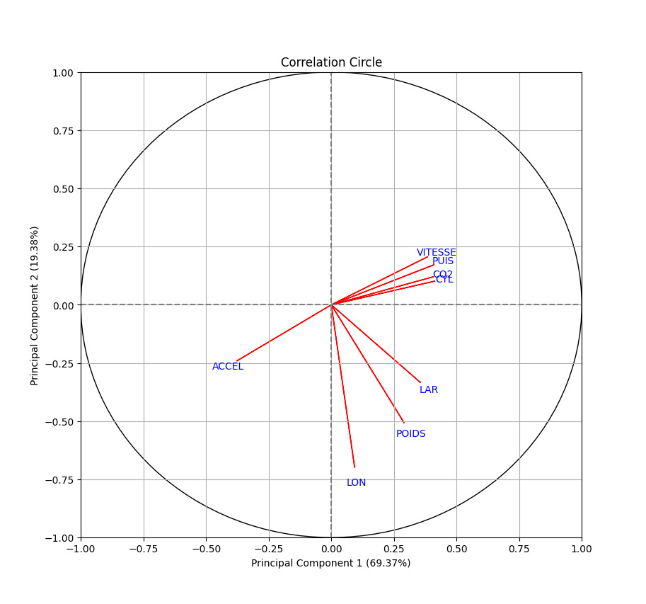
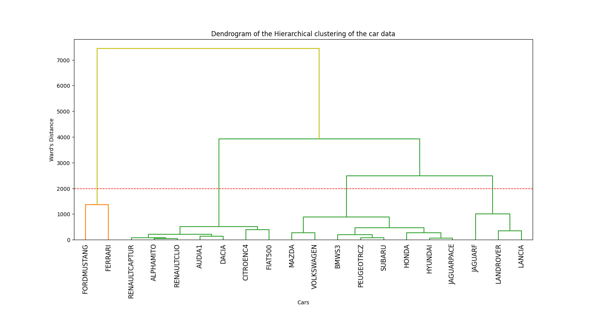

# Machine learning project on car data

### Project goal
The aim was to analyze, do clustering, dimension reduction and prediction from car and dog data. To do this, machine learning methods were used.

### Project steps
- Data analysis
- ML model selection : Logistic regression, Quadratic discriminant analysis, Regression tree, Random forest
- PCA (Principal component analysis)
- K-Means
- Hierarchical clustering
- Multiple correspondence analysis

### Libraries used
sklearn, pandas, seaborn, FactoMineR

